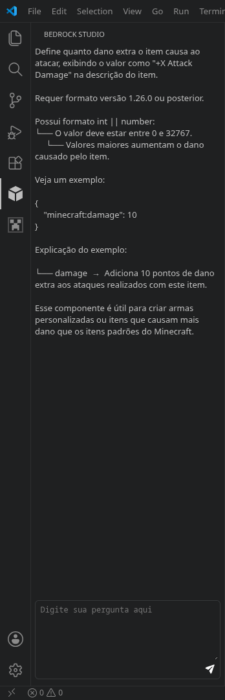

# Ease Bedrock Extension

Hello! PixelDevStudio here.

I created this extension to help beginners get started with Minecraft Bedrock add-on development. My goal is to build an AI assistant that can guide creators, answer questions, and make the learning process simpler and more accessible.

Currently, the AI only supports **Minecraft Bedrock items**. It can answer questions about item creation, components, properties, behaviors, and related features. Support for blocks, entities, scripting, and other add-on systems will be added in future updates.

This is just the beginning, and I plan to keep improving the AI by adding more knowledge, features, and support for the Bedrock Add-ons API over time.

# How to Use

After installing the extension, a new icon will appear in the VS Code Activity Bar. Click it to open the Ease Bedrock panel.

You'll find a text input where you can ask questions about Minecraft Bedrock items. Simply type your question and click the **Send** button to receive an answer.

> **Note:** Pressing **Enter** to send messages is **not supported yet**. Please use the **Send** button instead.
